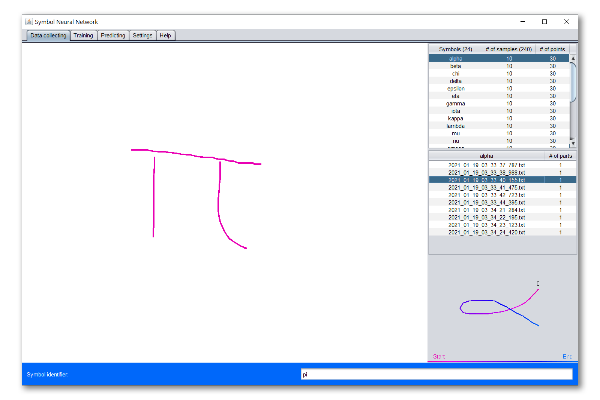
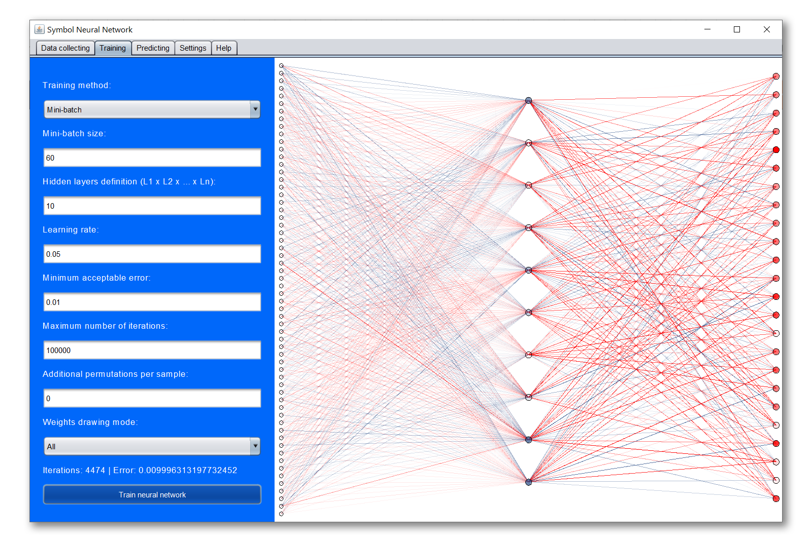
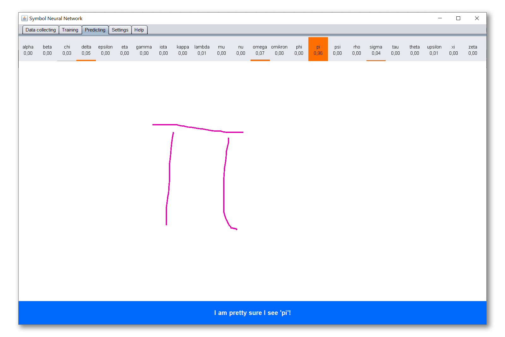
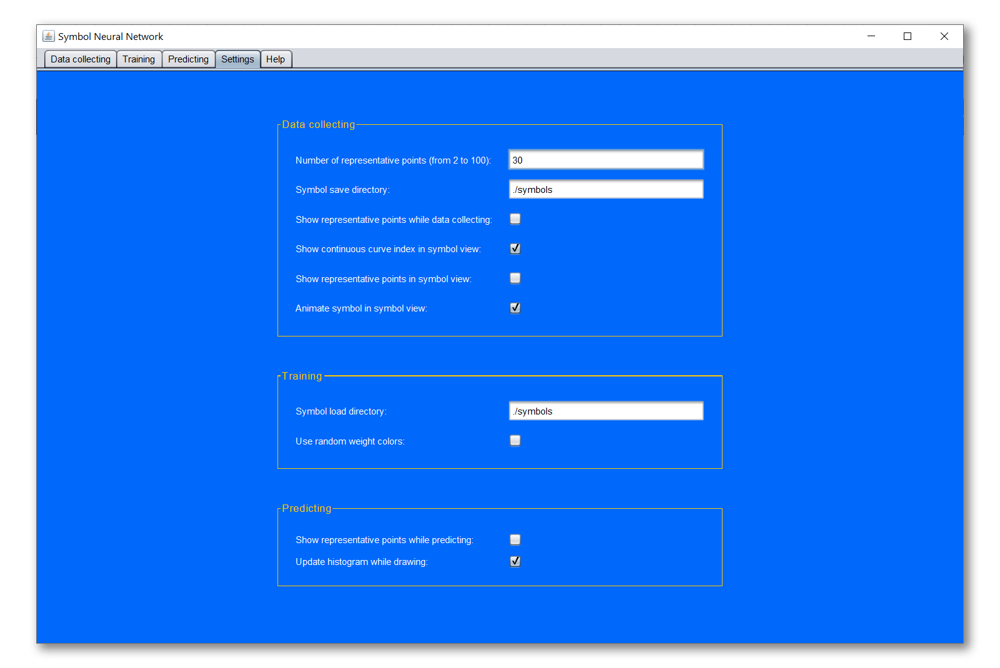
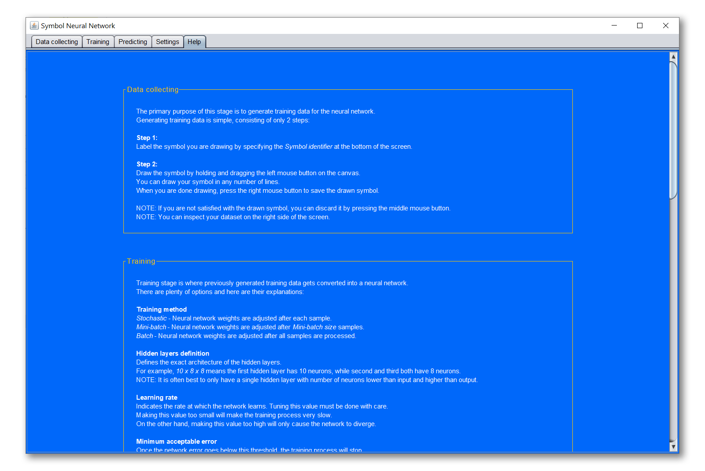

# ❓ What is it?
Symbol Neural Network is an application which allows the user to:
1. Generate training data by drawing training samples on the screen.
2. Train a feedforward neural network using desired variant of *backpropagation* algorithm.
3. Test the trained neural network on a problem of hand-written symbol classification.

# 📝 Data collecting
The primary purpose of this stage is to generate training data for the neural network.

Generating training data is simple, consisting of only 2 steps:

* **Step 1:** Label the symbol you are drawing by specifying the *Symbol identifier* at the bottom of the screen.

* **Step 2:** Draw the symbol by holding and dragging the left mouse button on the canvas. You can draw your symbol in any number of lines. When you are done drawing, press the right mouse button to save the drawn symbol.

**NOTE:** If you are not satisfied with the drawn symbol, you can discard it by pressing the middle mouse button.

**NOTE:** You can inspect your dataset on the right side of the screen.

---

# 📖 Training
Training stage is where previously generated training data gets converted into a neural network. There are plenty of options and here are their explanations:

### Training method
* *Stochastic* - Neural network weights are adjusted after each sample.
* *Mini-batch* - Neural network weights are adjusted after <i>Mini-batch size</i> samples.
* *Batch* - Neural network weights are adjusted after all samples are processed.

### Hidden layers definition
* Defines the exact architecture of the hidden layers. For example, `10 x 8 x 8` means the first hidden layer has 10 neurons, while second and third both have 8 neurons.

**NOTE:** It is often best to only have a single hidden layer with number of neurons lower than input and higher than output.

### Learning rate
* Indicates the rate at which the network learns. Tuning this value must be done with care. Making this value too small will make the training process very slow. On the other hand, making this value too high will only cause the network to diverge.

### Minimum acceptable error
* Once the network error goes below this threshold, the training process will stop.

### Maximum number of iterations
* Once the training exceeds this number of iterations, the training process will stop.

### Additional permutations per sample
* This option will increase the dataset by creating additional samples from existing ones. For example, if our dataset has 5 samples and this option is set to 2, for each of the 5 samples 2 additional will be generated. Final dataset size will be 5 (original) + 10 (additional) = 15 (total).

**NOTE:** This option is only used for analytic purposes and is best left at value 0.

### Weights drawing mode
* *All* - Drawn neural network will contain all of the weights.
* *Positive* - Drawn neural network will contain only positive weights.
* *Negative* - Drawn neural network will contain only negative weights.

---

# 🔮 Predicting
This stage can only be used once the neural network has been trained.
If you haven't done so yet, please consult *Data collecting* and *Training* sections above.

Once your network is trained, making predictions is trivial: simply draw a symbol and let the neural network guess!

* At the top of the screen a histogram is shown. It displays the neural network output layer values.

* At the bottom of the screen a neural network prediction is displayed, where the message will vary based on how certain the network is.

**NOTE:** To remove the currently drawn symbol and start a new one, press the drawing canvas with the right mouse button.

---

# ⚙️ Settings
Last, but not least, there are many settings which can be tweaked:

### 📝 Data collecting
* **Number of representative points:** Defines how many points will be sampled from the originally drawn symbol. For example, if this value is set to 10, every symbol that is drawn will be converted into 10 representative points. Consequently, this option defines the number of neurons in the input layer, which is double this value, as each point consists of x and y value.
* **Symbol save directory:** Specifies the path of the directory where all of the collected symbol samples will be saved.
* **Show representative points while data collecting:** When turned on, representative points will be shown in real-time as the symbol is being drawn in the data collecting stage.
* **Show continuous curve index in symbol view:** When turned on, symbol view (window in the bottom right corner) will display in what order the parts of the symbol were drawn, starting from index 0.
* **Show representative points in symbol view:** When turned on, representative points will be shown in symbol view window.
* **Animate symbol in symbol view:** When turned on, symbol view will animate symbol's drawing process in the exact same way as it was originally done by the artist.

### 📖 Training
* **Symbol load directory:** Specifies the path of the directory from where symbols will be loaded when training the neural network.
* **Use random weight colors:** Instead of positive and negative weight colors, random colors are used when drawing the neural network in the training stage.

### 🔮 Predicting
* **Show representative points while predicting:** When turned on, representative points will be shown in real-time as the symbol is being drawn in the predicting stage.
* **Update histogram while drawing:** When turned on, histogram will be updated live as the symbol is being drawn in the predicting stage.

---

# ℹ️ Help
Everything written in this `README` document can be found in the `Help` tab as well!

And that's it! Have fun classifying hand-written symbols! ✍️😊

